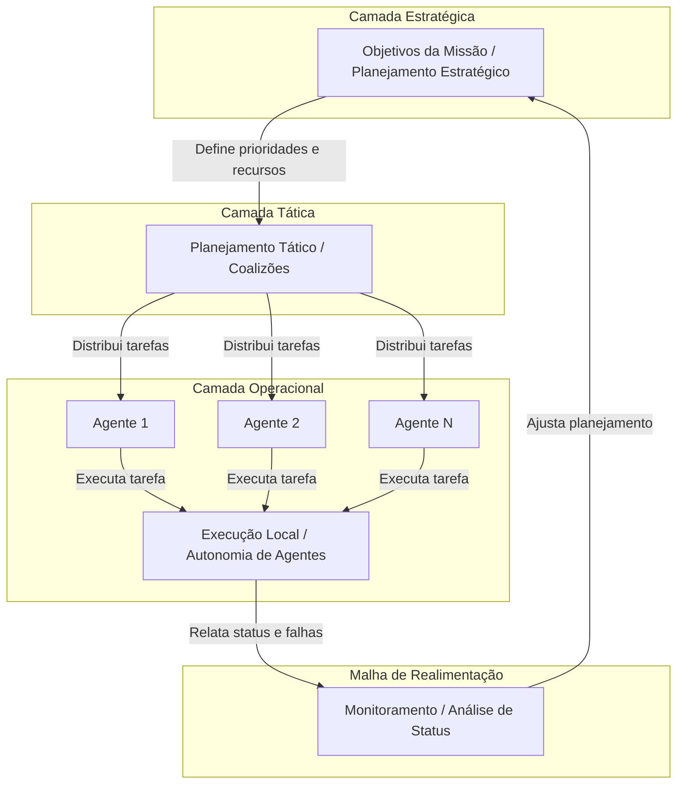

---

# MIRF: Mission Intelligence & Reconfiguration Framework

[](https://opensource.org/licenses/MIT)
[](https://github.com/your-username/MIRF)
[](http://www.ita.br/)

**MIRF (Mission Intelligence & Reconfiguration Framework)** é uma arquitetura de controle avançada, projetada como um plugin para o simulador **[PlaNAR UTM](#planar-utm)**. Seu objetivo é fortalecer a resiliência e a inteligência de missões de Veículos Aéreos Não Tripulados (UAS), especialmente em operações Além da Linha de Visada Visual (BVLOS).

O framework utiliza uma abordagem híbrida que combina **aprendizado profundo (Deep Learning)**, **redes de conhecimento especialistas** e **sistemas multiagentes (MAS)** para prevenir, detectar e reagir a falhas de forma autônoma, garantindo a segurança e a eficiência das operações em ecossistemas de Gerenciamento de Tráfego de UAS (UTM).

## Contexto: O Simulador PlaNAR UTM

O MIRF é uma extensão direta do **PlaNAR UTM**, um simulador de gerenciamento de tráfego aéreo não tripulado inspirado na lógica do UTM brasileiro. O PlaNAR UTM oferece uma arquitetura modular para estudos, testes operacionais e pesquisas acadêmicas, permitindo a simulação de cenários complexos com múltiplos provedores de serviço UTM (USS), operadores, drones e autoridades.

O ecossistema do simulador é composto por três sistemas integrados:

| Sigla | Nome | Função |
| :--- | :--- | :--- |
| **PlanAr UTM** | Núcleo do Simulador | Infraestrutura que integra provedores UTM, operadores, drones, conflitos e registros. |
| **MRCF** | Mission Replanning and Control Framework | Módulo de replanejamento tático, análise de rotas e reconfiguração dinâmica de missões. |
| **MIRF** | Módulo de Injeção e Recuperação de Falhas | **(Este repositório)** Emula falhas em drones, sensores e comunicação, e implementa estratégias de recuperação para avaliar a resiliência do sistema. |

## Motivação e Relevância

A crescente complexidade das operações com drones em ambientes urbanos e BVLOS exige sistemas que não apenas planejem missões, mas que também sejam capazes de **adaptar-se a eventos inesperados**. Falhas podem ocorrer em múltiplos níveis: no hardware do drone, na comunicação, no ambiente externo ou no conhecimento interno da operação.

O MIRF aborda esses desafios ao propor uma arquitetura que:
1.  **Simula Falhas:** Permite a injeção controlada de eventos adversos (determinísticos ou não) para testar a robustez do sistema.
2.  **Previne e Reage:** Utiliza conhecimento especialista e modelos de aprendizado para antecipar ou reagir eficientemente a falhas, reconfigurando a missão em tempo real.
3.  **Opera de Forma Descentralizada:** Foca na reconfiguração estratégica e tática sem depender de um comando centralizado, alinhando-se à natureza distribuída do UTM.

O framework se concentra em falhas de nível de missão e sistema, excluindo eventos de baixo nível relacionados ao controle de voo interno da aeronave.

## Arquitetura Conceitual do MIRF

Para garantir relevância e aplicabilidade ao longo do tempo, o MIRF é definido em um nível de **Engenharia de Sistemas**, sendo agnóstico a tecnologias específicas. A arquitetura é baseada em grafos conceituais e princípios de sistemas de controle.

### Princípios Centrais
*   **Separação de Camadas de Decisão:**
    *   **Estratégica:** Define os objetivos globais da missão (ex: "garantir 95% de cobertura de uma área").
    *   **Tática:** Coordena os agentes (drones) para cumprir as metas estratégicas, formando coalizões e distribuindo tarefas.
    *   **Operacional:** Cada agente executa suas tarefas com autonomia local, reagindo a eventos imediatos.
*   **Autonomia e Reconfiguração Dinâmica:** O sistema pode realocar recursos, redistribuir tarefas e formar novas coalizões de agentes para contornar falhas ou otimizar a missão.
*   **Realimentação Contínua (Feedback Loop):** O planejamento estratégico observa os resultados da execução tática e operacional, ajustando-se continuamente para garantir o sucesso da missão.

### Diagrama de Fluxo Conceitual

O diagrama abaixo ilustra a interação entre as camadas de decisão e o fluxo de realimentação.



## Abordagens Técnicas e Inovações

Embora a arquitetura seja agnóstica, sua implementação no PlaNAR UTM se baseia em um conjunto de tecnologias e abordagens de ponta da literatura de UTM e sistemas autônomos:

*   **Controle Híbrido (Model-Based + Learning-Based):** Combina controladores clássicos (como PID/MPC) com redes neurais (RL) para obter segurança e adaptabilidade.
*   **Aprendizado Guiado por Conhecimento (Knowledge-Guided ML):** Incorpora regras de negócio e restrições de segurança (ex: regras de separação) diretamente no processo de treinamento dos modelos de IA.
*   **Gêmeos Digitais (Digital Twins):** Modela os provedores de serviço (USS), o ambiente e os próprios agentes para realizar simulações *what-if* e otimizar decisões sem impactar o sistema real.
*   **Sistemas Multiagentes (MAS) e Teoria de Coalizão:** Utiliza agentes de software para negociar, formar coalizões e alocar tarefas de forma distribuída, aumentando a robustez.
*   **Verificação em Tempo de Execução (Runtime Verification):** Implementa "escudos de segurança" (*safety shields*) que monitoram o comportamento do sistema e intervêm para evitar ações perigosas.
*   **Aprendizado por Reforço Hierárquico (Hierarchical RL):** Estrutura o aprendizado em múltiplos níveis, permitindo que o sistema aprenda desde sub-tarefas motoras até metas estratégicas complexas.

## Como Citar Este Trabalho

Se você utilizar ou referenciar este projeto em pesquisas, relatórios ou publicações acadêmicas, por favor, utilize a citação abaixo.

**Formato Sugerido:**
> Jackson T. Veiga. **Mission Intelligence & Reconfiguration Framework (MIRF): An Advanced Fault Tolerance Architecture for BVLOS Operations in UTM Environments** (in proceeds). Aeronautics Institute of Technology (ITA), Department of Science and Space Technology (CTE), São José dos Campos, SP, Brazil, 2025.
> 📧 `jackson.veiga.101422@ga.ita.br`

**Formato BibTeX:**
```bibtex
@inproceedings{veiga2025mirf,
  author    = {Jackson T. Veiga},
  title     = {Mission Intelligence & Reconfiguration Framework (MIRF): An Advanced Fault Tolerance Architecture for BVLOS Operations in UTM Environments},
  booktitle = {Proceedings of the Aeronautics Institute of Technology (ITA), Department of Science and Space Technology (CTE)},
  year      = {2025},
  address   = {S\~ao Jos\'e dos Campos, SP, Brazil},
  note      = {(in proceeds)},
  email     = {jackson.veiga.101422@ga.ita.br}
}
```

## Referências Adicionais

   Jackson Tavares Veiga. MISSION REPLANNING AND CONTROL FRAMEWORK (MRCF): A STRATEGIC ARCHITECTURE FOR BVLOS OPERATIONS IN UTM ENVIRONMENTS. TechRxiv. November 11, 2025.
DOI: 10.36227/techrxiv.176283639.98510048/v1

 J. T. Veiga, M. A. Pessoa, F. Junqueira, P. E. Miyagi, and D. J. dos Santos Filho, “A systematic modelling procedure to design agent-oriented control to coalition of capabilities—in the context of I4.0 as virtual assets (AAS),” *Computers*, vol. 10, no. 12, p. 161, 2021.

 J. T. Veiga, “Proposta de um método para o controle de coalizão de recursos virtuais baseado em multi-agentes no contexto I4.0,” Ph.D. dissertation, Universidade de São Paulo, 2022.

 J. T. Veiga, “An Open Framework for UAS Mission Replanning: From Intellectual Property to Collaborative Research,” in *Proceedings of the [Conference AIAA]*, 2025. (Versão Completa em Revisão).

 F. L. S. D. Santos, “pyAutonomousAgent: An academic tool for modeling autonomous agent behaviors using behavior trees,” *JATM*, 2023. [Online]. Available: https://www.scielo.br/j/jatm/a/fqNpVmY4RhchPsGQGdjpXVd/

---
